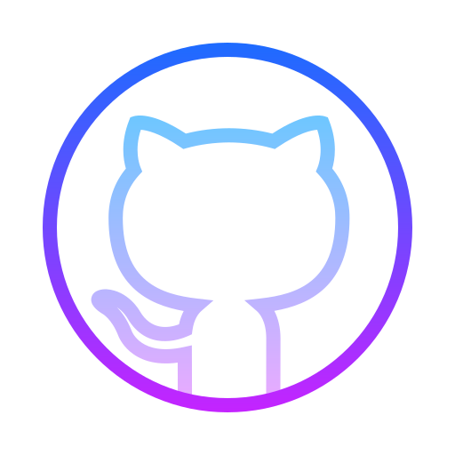

<p align="center"> 
   
</p>

<div align="center">
  <h2> <strong> Actively Learning </strong></h2>
   <br> 
  <h2> <strong> Plan to Learn </strong></h2>
  
</div>

```python
# What am I?
class Me(Human):
  def __init__(self):
    super().__init__("Asal Delkhosh", "Girl", 22)
    self.love = "Choco"
    self.job = "Data Science" 
    self.hopeful = True
    self.intrests = ["Python", "ML", "Graphic Design", "Food"]


# start life program
if __name__ == "__main__":
  # create instance of me
  me = Me()
  # life loop
  while me.is_alive():
    me.work_hard()
    
    if me.disappointed() or me.tired():
      me.see_my_love()
    
    me.eat()
    me.sleep()
    me.eat_again()

```

<p align="center">

</p>


  <h3 align="center">Connect With Me</h3>
<p align="center">
  <a href="https://www.linkedin.com/in/mahdiramazani/" target="_blank">
    
  </a> &nbsp;&nbsp;
  
  <a href="https://profile-summary-for-github.herokuapp.com/user/mahdiramazani" target="_blank">
    
  </a> &nbsp;&nbsp;
  
  <a href="mailto:mahdiramazanii.official@gmail.com" target="_blank">
    
  </a> &nbsp;&nbsp;

  <a href="https://dev.to/mahdiramazani" target="_blank">
    
</a> &nbsp;&nbsp;
  <a>
    
    <span>mahdiramazani</span>
</p> 
